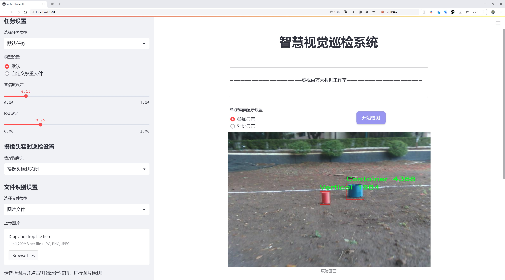
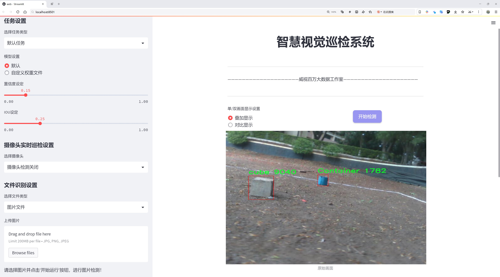
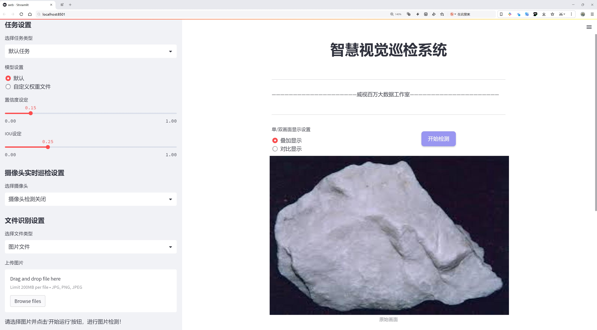
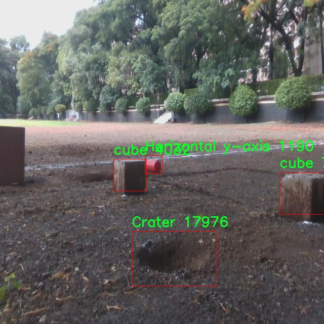
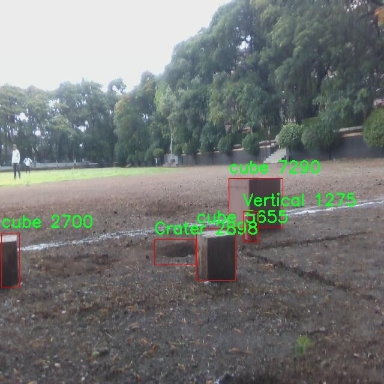
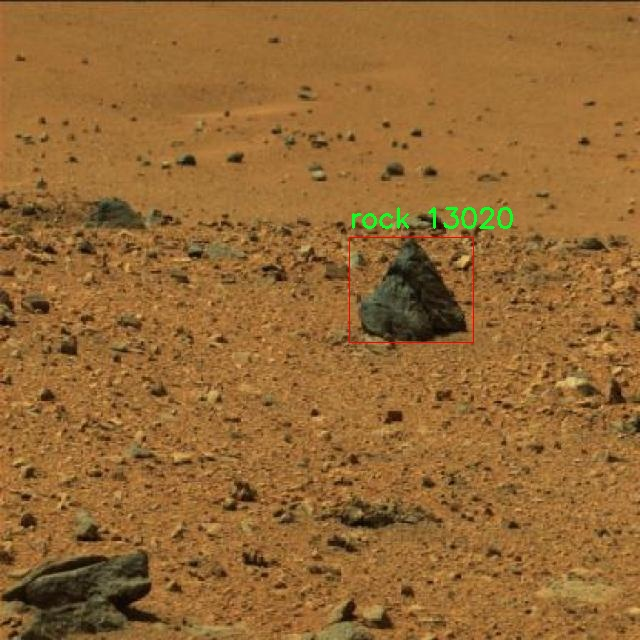
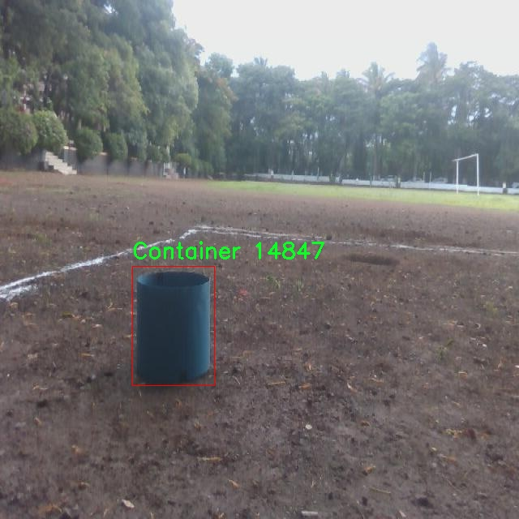
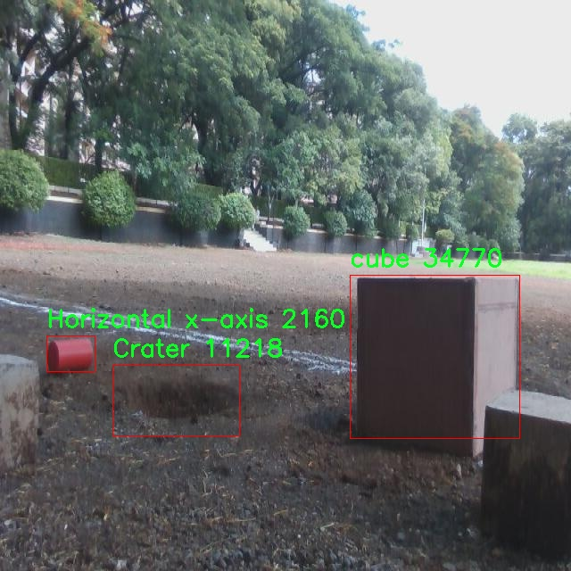

# 地质样本检测检测系统源码分享
 # [一条龙教学YOLOV8标注好的数据集一键训练_70+全套改进创新点发刊_Web前端展示]

### 1.研究背景与意义

项目参考[AAAI Association for the Advancement of Artificial Intelligence](https://gitee.com/qunmasj/projects)

项目来源[AACV Association for the Advancement of Computer Vision](https://github.com/qunshansj/good)

研究背景与意义

随着地质科学的不断发展，地质样本的采集与分析在资源勘探、环境监测和灾害预警等领域中发挥着越来越重要的作用。传统的地质样本检测方法往往依赖于人工观察和手动分类，这不仅耗时耗力，而且容易受到人为因素的影响，导致检测结果的准确性和一致性不足。因此，亟需一种高效、准确的自动化检测系统，以提高地质样本的处理效率和可靠性。

近年来，深度学习技术的迅猛发展为图像识别和物体检测提供了新的解决方案。YOLO（You Only Look Once）系列模型因其高效的实时检测能力和较高的准确率，已成为物体检测领域的主流方法之一。特别是YOLOv8作为该系列的最新版本，进一步提升了模型的性能和适用性，能够在复杂的环境中实现快速而准确的物体检测。因此，基于改进YOLOv8的地质样本检测系统的研究具有重要的理论价值和实际意义。

本研究的核心在于构建一个基于YOLOv8的地质样本检测系统，利用5272幅图像和10个类别的地质样本数据集进行训练和测试。该数据集涵盖了多种地质样本类型，包括“Bonus”、“Container”、“Crater”、“Horizontal x-axis”、“Horizontal y-axis”、“Vertical”、“buried--rock”、“cube”、“rock”和“sample”，这些类别的多样性为模型的训练提供了丰富的样本，有助于提高模型的泛化能力和识别精度。

通过对YOLOv8模型的改进，我们可以在保持高检测速度的同时，进一步提升其在地质样本检测中的准确性。这一改进不仅能够有效降低误检和漏检的概率，还能增强模型对不同地质样本特征的学习能力，从而实现对复杂地质环境中样本的精准识别。此外，改进后的检测系统还能够为地质研究人员提供实时反馈，帮助他们快速获取样本信息，优化后续的实验和分析流程。

在实际应用中，基于改进YOLOv8的地质样本检测系统将为地质勘探、环境监测等领域提供强有力的技术支持。通过自动化的样本检测，研究人员可以将更多的时间和精力投入到数据分析和决策制定中，从而提升整体工作效率。同时，该系统的推广应用也将推动地质科学与人工智能技术的深度融合，为相关领域的研究提供新的思路和方法。

综上所述，基于改进YOLOv8的地质样本检测系统的研究不仅具有重要的学术价值，也具备广泛的应用前景。通过该系统的构建与应用，我们期待能够为地质样本的高效检测提供一种创新的解决方案，推动地质科学的发展与进步。

### 2.图片演示







##### 注意：由于此博客编辑较早，上面“2.图片演示”和“3.视频演示”展示的系统图片或者视频可能为老版本，新版本在老版本的基础上升级如下：（实际效果以升级的新版本为准）

  （1）适配了YOLOV8的“目标检测”模型和“实例分割”模型，通过加载相应的权重（.pt）文件即可自适应加载模型。

  （2）支持“图片识别”、“视频识别”、“摄像头实时识别”三种识别模式。

  （3）支持“图片识别”、“视频识别”、“摄像头实时识别”三种识别结果保存导出，解决手动导出（容易卡顿出现爆内存）存在的问题，识别完自动保存结果并导出到tempDir中。

  （4）支持Web前端系统中的标题、背景图等自定义修改，后面提供修改教程。

  另外本项目提供训练的数据集和训练教程,暂不提供权重文件（best.pt）,需要您按照教程进行训练后实现图片演示和Web前端界面演示的效果。

### 3.视频演示

[3.1 视频演示](https://www.bilibili.com/video/BV1SAHeesEjV/?vd_source=ff015de2d29cbe2a9cdbfa7064407a08)

### 4.数据集信息展示

数据集信息展示

在本研究中，我们采用了名为“Final Object Detection”的数据集，以支持对地质样本检测系统的改进，特别是针对YOLOv8模型的训练和优化。该数据集的设计旨在提供丰富的地质样本图像，以便在不同环境和条件下进行有效的物体检测。数据集包含10个类别，涵盖了多种地质特征和样本，这些类别分别是：Bonus、Container、Crater、Horizontal x-axis、Horizontal y-axis、Vertical、buried-rock、cube、rock和sample。

首先，数据集中的“Bonus”类别可能代表了一些特殊的地质样本或标记，这些样本在地质研究中具有重要的参考价值。它们可能是一些罕见的矿物或岩石，或者是研究者在实地考察中发现的具有特殊意义的样本。这一类别的存在，能够帮助模型在训练过程中识别和区分这些重要的地质特征。

接下来，“Container”类别则可能指代用于存放或运输地质样本的容器。这些容器在样本采集和分析过程中扮演着重要角色，因此在物体检测系统中对其进行准确识别是至关重要的。通过识别容器，系统可以更好地理解样本的来源和处理方式，从而提高整体的检测精度。

“Crater”类别则涉及到地质特征中的陨石坑或其他类型的凹陷，这些特征在地质调查和遥感分析中具有重要意义。通过对陨石坑的检测，研究者可以获取有关地表变化、地质活动和历史事件的信息，从而为地质研究提供有力支持。

在数据集中，“Horizontal x-axis”和“Horizontal y-axis”类别可能用于标识在地质图像中呈现的特定方向或坐标轴。这一信息对于理解样本的空间分布和地质结构的分析至关重要。通过将这些坐标轴信息纳入检测系统，模型能够更准确地定位和分析样本在空间中的位置。

“Vertical”类别则可能与地质样本的垂直特征相关，这对于分析地层结构和地质剖面至关重要。通过识别垂直特征，系统可以更好地理解样本的层次关系和成因。

“buried-rock”类别代表了埋藏在地表下的岩石，这一类别的识别对于地下资源的勘探和地质研究具有重要意义。通过准确检测埋藏岩石，研究者可以获取有关地下结构和资源分布的关键信息。

此外，“cube”类别可能指代某种特定形状的地质样本，这些样本的几何特征可能在研究中提供额外的分析维度。而“rock”类别则是最基本的地质样本类型，涵盖了各种岩石的特征，作为数据集的核心组成部分，其重要性不言而喻。

最后，“sample”类别则是一个通用类别，可能包含了各种类型的地质样本，作为对其他类别的补充，确保模型能够处理多样化的样本类型。

综上所述，“Final Object Detection”数据集通过丰富的类别设置，为改进YOLOv8的地质样本检测系统提供了坚实的基础。每个类别的设置不仅反映了地质研究的多样性，也为模型的训练和优化提供了必要的支持，旨在提升物体检测的准确性和效率。通过对这些类别的深入分析和理解，我们期望能够推动地质样本检测技术的发展，为相关领域的研究提供更为精准的工具和方法。











### 5.全套项目环境部署视频教程（零基础手把手教学）

[5.1 环境部署教程链接（零基础手把手教学）](https://www.ixigua.com/7404473917358506534?logTag=c807d0cbc21c0ef59de5)


[5.2 安装Python虚拟环境创建和依赖库安装视频教程链接（零基础手把手教学）](https://www.ixigua.com/7404474678003106304?logTag=1f1041108cd1f708b01a)

### 6.手把手YOLOV8训练视频教程（零基础小白有手就能学会）

[6.1 环境部署教程链接（零基础手把手教学）](https://www.ixigua.com/7404477157818401292?logTag=d31a2dfd1983c9668658)

### 7.70+种全套YOLOV8创新点代码加载调参视频教程（一键加载写好的改进模型的配置文件）

[7.1 环境部署教程链接（零基础手把手教学）](https://www.ixigua.com/7404478314661806627?logTag=29066f8288e3f4eea3a4)

### 8.70+种全套YOLOV8创新点原理讲解（非科班也可以轻松写刊发刊，V10版本正在科研待更新）

由于篇幅限制，每个创新点的具体原理讲解就不一一展开，具体见下列网址中的创新点对应子项目的技术原理博客网址【Blog】：


[8.1 70+种全套YOLOV8创新点原理讲解链接](https://gitee.com/qunmasj/good)

### 9.系统功能展示（检测对象为举例，实际内容以本项目数据集为准）

图9.1.系统支持检测结果表格显示

  图9.2.系统支持置信度和IOU阈值手动调节

  图9.3.系统支持自定义加载权重文件best.pt(需要你通过步骤5中训练获得)

  图9.4.系统支持摄像头实时识别

  图9.5.系统支持图片识别

  图9.6.系统支持视频识别

  图9.7.系统支持识别结果文件自动保存

  图9.8.系统支持Excel导出检测结果数据


### 10.原始YOLOV8算法原理

原始YOLOv8算法原理

YOLOv8算法作为YOLO系列的最新进展，代表了目标检测领域的一次重要革新。其设计理念是以高效、准确的目标检测为核心，力求在保持实时性和轻量化的同时，提升检测精度和对小目标的感知能力。YOLOv8在YOLOv5的基础上进行了多方面的优化，主要包括网络结构的改进、特征提取方法的升级以及检测头的创新设计。

YOLOv8的网络结构可以分为三个主要部分：主干网络（Backbone）、特征融合网络（Neck）和检测头（Head）。在主干网络中，YOLOv8采用了C2F模块替代了原有的C3模块，C2F模块通过3×3的卷积操作和深度分离卷积的结合，显著降低了计算复杂度，同时保持了特征提取的能力。通过这种方式，YOLOv8能够在较小的模型体积下，提取出丰富的特征信息，为后续的目标检测提供了坚实的基础。

特征融合网络是YOLOv8的另一大亮点。它结合了特征金字塔网络（FPN）和路径聚合网络（PAN），通过多尺度特征的有效融合，提升了模型对不同尺度目标的检测能力。特征金字塔网络通过构建金字塔结构，能够捕捉到不同层次的特征信息，而路径聚合网络则通过上采样和下采样的结合，进一步增强了特征的表达能力。此外，YOLOv8引入了BiFPN网络，通过高效的双向跨尺度连接和加权特征融合，优化了特征信息的流动和整合，确保了模型在处理复杂场景时的鲁棒性。

在检测头部分，YOLOv8采用了轻量化的解耦头设计，这一创新使得分类和回归任务能够独立进行，从而提高了检测的精度和速度。传统的锚框检测方法在复杂背景下容易出现定位误差，而YOLOv8的anchor-free方法则有效地缓解了这一问题。通过Task-Aligned Assigner机制，YOLOv8能够对分类分数和回归分数进行加权，从而更精准地匹配正样本，提高了检测的准确性。

值得注意的是，YOLOv8在小目标检测方面也做出了重要改进。为了应对小目标漏检的问题，YOLOv8引入了更小的检测头，增强了网络对小目标的感知能力。同时，在Neck端采用了GSConv和Slim-neck技术，这些技术不仅提升了模型的精度，还有效降低了计算量，使得YOLOv8在保持高性能的同时，能够在资源受限的环境中运行。

在损失函数的设计上，YOLOv8使用了MPDIoU损失函数替代了传统的CIoU损失函数，这一改进显著提高了模型的泛化能力和检测精度。MPDIoU损失函数通过考虑目标的中心点、宽高比和重叠度等多方面因素，使得模型在训练过程中能够更好地适应不同场景下的目标特征。

YOLOv8的设计不仅关注模型的性能，还注重实际应用中的灵活性和可扩展性。其采用的Pytorch训练和部署框架，使得用户能够根据具体需求自定义模型，进一步提升了YOLOv8在不同应用场景下的适应能力。

总的来说，YOLOv8算法通过一系列创新设计和技术优化，成功地在目标检测领域树立了新的标杆。其轻量化的网络结构、高效的特征融合方法以及精准的检测机制，使得YOLOv8在复杂环境下的目标检测任务中表现出色。尽管在某些特定场景下仍存在一定的局限性，但YOLOv8无疑为目标检测技术的发展提供了新的思路和方向。未来，随着技术的不断进步和应用场景的不断拓展，YOLOv8及其衍生算法有望在更多领域中发挥重要作用。


### 11.项目核心源码讲解（再也不用担心看不懂代码逻辑）

#### 11.1 ultralytics\data\explorer\__init__.py

以下是对给定代码的核心部分进行分析和详细注释的结果：

```python
# Ultralytics YOLO 🚀, AGPL-3.0 license

# 从当前包的 utils 模块中导入 plot_query_result 函数
from .utils import plot_query_result

# 定义模块的公共接口，指定哪些对象可以被外部访问
__all__ = ["plot_query_result"]
```

### 代码分析与注释：

1. **导入语句**：
   ```python
   from .utils import plot_query_result
   ```
   - 这行代码从当前包（模块）中的 `utils` 模块导入了 `plot_query_result` 函数。这里的 `.` 表示当前包，确保导入的是同一包内的模块。

2. **模块公共接口**：
   ```python
   __all__ = ["plot_query_result"]
   ```
   - `__all__` 是一个特殊的变量，用于定义模块的公共接口。当使用 `from module import *` 语句时，只有在 `__all__` 列表中的对象会被导入。这里指定了 `plot_query_result` 函数为可公开访问的对象。

### 总结：
该代码片段的核心功能是导入一个工具函数 `plot_query_result` 并将其添加到模块的公共接口中，以便其他模块可以方便地使用这个函数。

这个文件是一个Python模块的初始化文件，位于`ultralytics\data\explorer`目录下。它的主要功能是定义该模块的公共接口，并导入其他模块中的功能。

首先，文件开头的注释`# Ultralytics YOLO 🚀, AGPL-3.0 license`表明这个项目是Ultralytics开发的YOLO（You Only Look Once）系列模型的一部分，并且它遵循AGPL-3.0许可证。这意味着用户可以自由使用和修改代码，但在分发修改后的版本时需要遵循相同的许可证条款。

接下来，文件通过`from .utils import plot_query_result`这一行代码从同一目录下的`utils`模块中导入了`plot_query_result`函数。这意味着在使用这个模块时，用户可以直接调用`plot_query_result`这个函数，而不需要知道它的具体实现细节。

最后，`__all__ = ["plot_query_result"]`这一行定义了模块的公共接口，明确指出在使用`from explorer import *`时，只有`plot_query_result`会被导入。这是一种良好的编程习惯，可以帮助控制模块的可见性，避免不必要的命名冲突。

总体来说，这个文件的作用是为`ultralytics\data\explorer`模块提供一个简洁的接口，使得其他模块或用户可以方便地使用`plot_query_result`函数。

#### 11.2 ui.py

```python
import sys
import subprocess

def run_script(script_path):
    """
    使用当前 Python 环境运行指定的脚本。

    Args:
        script_path (str): 要运行的脚本路径

    Returns:
        None
    """
    # 获取当前 Python 解释器的路径
    python_path = sys.executable

    # 构建运行命令
    command = f'"{python_path}" -m streamlit run "{script_path}"'

    # 执行命令
    result = subprocess.run(command, shell=True)
    if result.returncode != 0:
        print("脚本运行出错。")


# 实例化并运行应用
if __name__ == "__main__":
    # 指定您的脚本路径
    script_path = "web.py"  # 这里可以直接指定脚本路径

    # 运行脚本
    run_script(script_path)
```

### 代码注释说明：

1. **导入模块**：
   - `import sys`：导入系统相关的模块，用于获取当前 Python 解释器的路径。
   - `import subprocess`：导入子进程模块，用于执行外部命令。

2. **定义 `run_script` 函数**：
   - 该函数接受一个参数 `script_path`，表示要运行的 Python 脚本的路径。
   - 函数内部首先获取当前 Python 解释器的路径，以便后续调用。

3. **构建命令**：
   - 使用 f-string 格式化字符串，构建运行命令，命令格式为：`"{python_path}" -m streamlit run "{script_path}"`。
   - 该命令将使用当前 Python 环境中的 `streamlit` 模块来运行指定的脚本。

4. **执行命令**：
   - 使用 `subprocess.run` 执行构建的命令，`shell=True` 允许在 shell 中执行命令。
   - 检查命令执行的返回码，如果返回码不为 0，表示脚本运行出错，打印错误信息。

5. **主程序入口**：
   - 使用 `if __name__ == "__main__":` 确保该部分代码仅在直接运行脚本时执行。
   - 指定要运行的脚本路径为 `web.py`。
   - 调用 `run_script` 函数，传入脚本路径以执行该脚本。

这个程序文件名为 `ui.py`，主要功能是使用当前的 Python 环境来运行一个指定的脚本。代码首先导入了必要的模块，包括 `sys`、`os` 和 `subprocess`，以及一个自定义模块 `QtFusion.path` 中的 `abs_path` 函数。

在 `run_script` 函数中，首先获取当前 Python 解释器的路径，这样可以确保使用正确的 Python 环境来执行脚本。接着，构建一个命令字符串，该命令使用 `streamlit` 模块来运行指定的脚本。`streamlit` 是一个用于构建数据应用的流行库，通常用于快速开发和展示数据可视化应用。

然后，使用 `subprocess.run` 方法来执行构建好的命令。这个方法会在一个新的 shell 中运行命令，并等待其完成。如果脚本运行过程中出现错误，返回的 `returncode` 将不为零，此时程序会打印出“脚本运行出错”的提示信息。

在文件的最后部分，使用 `if __name__ == "__main__":` 语句来确保只有在直接运行该文件时才会执行下面的代码。这里指定了要运行的脚本路径，即 `web.py`，并调用 `run_script` 函数来执行这个脚本。

整体来看，这个程序的设计目的是为了方便用户在特定的 Python 环境中运行一个 Streamlit 应用脚本，提供了一种简单的方式来启动和管理数据可视化应用。

#### 11.3 ultralytics\models\yolo\segment\train.py

以下是代码中最核心的部分，并附上详细的中文注释：

```python
from ultralytics.models import yolo
from ultralytics.nn.tasks import SegmentationModel
from ultralytics.utils import DEFAULT_CFG, RANK
from ultralytics.utils.plotting import plot_images, plot_results

class SegmentationTrainer(yolo.detect.DetectionTrainer):
    """
    该类扩展了 DetectionTrainer 类，用于基于分割模型的训练。
    示例用法：
        ```python
        from ultralytics.models.yolo.segment import SegmentationTrainer

        args = dict(model='yolov8n-seg.pt', data='coco8-seg.yaml', epochs=3)
        trainer = SegmentationTrainer(overrides=args)
        trainer.train()
        ```
    """

    def __init__(self, cfg=DEFAULT_CFG, overrides=None, _callbacks=None):
        """初始化 SegmentationTrainer 对象，使用给定的参数。"""
        if overrides is None:
            overrides = {}
        overrides["task"] = "segment"  # 设置任务类型为分割
        super().__init__(cfg, overrides, _callbacks)  # 调用父类构造函数

    def get_model(self, cfg=None, weights=None, verbose=True):
        """返回使用指定配置和权重初始化的 SegmentationModel。"""
        model = SegmentationModel(cfg, ch=3, nc=self.data["nc"], verbose=verbose and RANK == -1)
        if weights:
            model.load(weights)  # 如果提供了权重，则加载权重

        return model  # 返回初始化的模型

    def get_validator(self):
        """返回用于验证 YOLO 模型的 SegmentationValidator 实例。"""
        self.loss_names = "box_loss", "seg_loss", "cls_loss", "dfl_loss"  # 定义损失名称
        return yolo.segment.SegmentationValidator(
            self.test_loader, save_dir=self.save_dir, args=copy(self.args), _callbacks=self.callbacks
        )  # 返回验证器实例

    def plot_training_samples(self, batch, ni):
        """创建带有标签和框坐标的训练样本图像的绘图。"""
        plot_images(
            batch["img"],  # 训练样本图像
            batch["batch_idx"],  # 批次索引
            batch["cls"].squeeze(-1),  # 类别标签
            batch["bboxes"],  # 边界框
            masks=batch["masks"],  # 分割掩码
            paths=batch["im_file"],  # 图像文件路径
            fname=self.save_dir / f"train_batch{ni}.jpg",  # 保存图像的文件名
            on_plot=self.on_plot,  # 绘图回调
        )

    def plot_metrics(self):
        """绘制训练/验证指标。"""
        plot_results(file=self.csv, segment=True, on_plot=self.on_plot)  # 保存结果为 results.png
```

### 代码核心部分说明：
1. **类 SegmentationTrainer**：继承自 `DetectionTrainer`，用于处理分割任务的训练。
2. **初始化方法 `__init__`**：设置任务类型为分割，并调用父类的初始化方法。
3. **方法 `get_model`**：创建并返回一个分割模型实例，支持加载预训练权重。
4. **方法 `get_validator`**：返回一个验证器实例，用于模型的验证过程。
5. **方法 `plot_training_samples`**：绘制训练样本的图像，包括标签和边界框信息。
6. **方法 `plot_metrics`**：绘制训练和验证过程中的指标图表。

这个程序文件是用于训练YOLO（You Only Look Once）模型进行图像分割的。它继承自YOLO的检测训练器类，专门针对分割任务进行了扩展。文件中首先导入了一些必要的模块和类，包括YOLO模型、分割模型、默认配置、排名以及绘图工具。

在`SegmentationTrainer`类中，构造函数`__init__`接受配置参数、覆盖参数和回调函数。它会将任务类型设置为“segment”，并调用父类的构造函数进行初始化。

`get_model`方法用于返回一个初始化好的分割模型。它接受配置和权重参数，如果提供了权重，则会加载这些权重。模型的通道数设置为3（通常对应RGB图像），类别数则从数据集中获取。

`get_validator`方法返回一个分割验证器实例，用于对YOLO模型进行验证。在这个方法中，定义了损失名称，包括框损失、分割损失、分类损失和DFL损失。验证器会使用测试数据加载器、保存目录和其他参数进行初始化。

`plot_training_samples`方法用于绘制训练样本的图像，包括标签和框坐标。它调用了`plot_images`函数，将训练批次的图像、索引、类别、边界框和掩码等信息进行可视化，并将结果保存为图像文件。

最后，`plot_metrics`方法用于绘制训练和验证过程中的指标，调用`plot_results`函数来生成相应的图表，并保存结果。

整体来看，这个文件提供了一个结构化的方式来训练YOLO模型进行图像分割任务，包含了模型初始化、验证、可视化等功能，便于用户进行模型训练和评估。

#### 11.4 ultralytics\engine\model.py

以下是经过简化和注释的核心代码部分，主要保留了模型的初始化、加载、预测等关键功能。

```python
import inspect
import sys
from pathlib import Path
from typing import Union
from ultralytics.nn import nn  # 导入PyTorch的nn模块

class Model(nn.Module):
    """
    YOLO模型的基础类，统一所有模型的API接口。
    """

    def __init__(self, model: Union[str, Path] = "yolov8n.pt", task=None, verbose=False) -> None:
        """
        初始化YOLO模型。

        Args:
            model (Union[str, Path], optional): 要加载或创建的模型路径或名称，默认为'yolov8n.pt'。
            task (Any, optional): YOLO模型的任务类型，默认为None。
            verbose (bool, optional): 是否启用详细模式。
        """
        super().__init__()
        self.model = None  # 模型对象
        self.task = task  # 任务类型
        self.model_name = str(model).strip()  # 去除模型名称的空格

        # 检查并加载模型
        model = self._check_and_load_model(model, task, verbose)

    def _check_and_load_model(self, model, task, verbose):
        """
        检查模型类型并加载模型。

        Args:
            model: 模型路径或名称
            task: 任务类型
            verbose: 是否详细输出

        Returns:
            加载后的模型路径
        """
        # 如果是HUB模型，则从HUB获取模型
        if self.is_hub_model(model):
            model = self._get_hub_model(model)

        # 如果是Triton Server模型，直接返回
        elif self.is_triton_model(model):
            self.model = model
            return model

        # 加载或创建新的YOLO模型
        model = self._add_suffix_to_model(model)
        if Path(model).suffix in (".yaml", ".yml"):
            self._new(model, task=task, verbose=verbose)  # 从配置文件创建新模型
        else:
            self._load(model, task=task)  # 从权重文件加载模型

        return model

    def _new(self, cfg: str, task=None, model=None, verbose=False):
        """
        从配置文件初始化新模型。

        Args:
            cfg (str): 模型配置文件
            task (str | None): 模型任务
            model (BaseModel): 自定义模型
            verbose (bool): 是否显示模型信息
        """
        cfg_dict = yaml_model_load(cfg)  # 加载yaml配置
        self.cfg = cfg
        self.task = task or guess_model_task(cfg_dict)  # 推测任务类型
        self.model = (model or self._smart_load("model"))(cfg_dict, verbose=verbose)  # 创建模型

    def _load(self, weights: str, task=None):
        """
        从权重文件加载模型。

        Args:
            weights (str): 要加载的模型权重
            task (str | None): 模型任务
        """
        self.model, self.ckpt = attempt_load_one_weight(weights)  # 加载权重
        self.task = self.model.args["task"]  # 获取任务类型

    def predict(self, source=None, stream=False, **kwargs):
        """
        使用YOLO模型进行预测。

        Args:
            source (str | int | PIL | np.ndarray): 要进行预测的图像源。
            stream (bool): 是否流式预测，默认为False。
            **kwargs: 传递给预测器的其他关键字参数。

        Returns:
            预测结果列表。
        """
        if source is None:
            source = ASSETS  # 默认源
        # 设置预测参数
        custom = {"conf": 0.25, "save": True}
        args = {**self.overrides, **custom, **kwargs, "mode": "predict"}  # 合并参数
        # 初始化预测器
        if not self.predictor:
            self.predictor = self._smart_load("predictor")(overrides=args)
            self.predictor.setup_model(model=self.model)
        return self.predictor(source=source, stream=stream)  # 返回预测结果

    @staticmethod
    def is_hub_model(model):
        """检查提供的模型是否为HUB模型。"""
        return model.startswith("https://hub.ultralytics.com/models/")

    @staticmethod
    def is_triton_model(model):
        """检查模型是否为Triton Server URL字符串。"""
        from urllib.parse import urlsplit
        url = urlsplit(model)
        return url.netloc and url.path and url.scheme in {"http", "grpc"}

    def _add_suffix_to_model(self, model):
        """为模型添加后缀以确保正确的文件格式。"""
        return f"{model}.pt" if not Path(model).suffix else model

    def _smart_load(self, key):
        """加载模型、训练器、验证器或预测器。"""
        try:
            return self.task_map[self.task][key]
        except Exception as e:
            raise NotImplementedError(f"模型不支持此任务。") from e

    @property
    def task_map(self):
        """返回任务到模型、训练器、验证器和预测器类的映射。"""
        raise NotImplementedError("请提供模型的任务映射！")
```

### 代码注释说明：
1. **类和方法的定义**：代码中定义了一个`Model`类，包含初始化、加载、预测等方法。
2. **模型的初始化**：在`__init__`方法中，模型路径和任务类型被传入并处理。
3. **模型加载**：`_check_and_load_model`方法负责检查模型类型并加载相应的模型。
4. **预测功能**：`predict`方法实现了模型的预测功能，支持多种输入源。
5. **辅助方法**：包括检查模型类型、添加后缀等辅助功能，确保模型正确加载和使用。

以上是代码的核心部分和详细注释，帮助理解YOLO模型的基本结构和功能。

这个程序文件是Ultralytics YOLO模型的核心实现部分，主要定义了一个名为`Model`的类，该类统一了YOLO模型的API接口。该类的构造函数接收模型文件的路径或名称以及任务类型，初始化模型所需的各种属性。

在`__init__`方法中，首先调用父类的构造函数，然后初始化一些模型相关的属性，例如预测器、模型对象、训练器、检查点等。接着，它会检查所提供的模型是否来自Ultralytics HUB或Triton Server，并根据情况加载相应的模型文件。如果模型文件是YAML格式的配置文件，则调用`_new`方法初始化一个新模型；如果是权重文件，则调用`_load`方法加载模型。

`Model`类还实现了多个方法，其中`__call__`方法允许通过调用模型对象来进行预测，实际上是调用了`predict`方法。`_new`和`_load`方法分别用于创建新模型和加载已有模型的权重，`_check_is_pytorch_model`方法用于检查当前模型是否为PyTorch模型。

模型的重置、信息获取、模型融合、预测、跟踪、验证、基准测试、导出和训练等功能都通过相应的方法实现。比如，`predict`方法用于执行预测，接受多种输入源，`train`方法用于在给定数据集上训练模型。

此外，类中还定义了一些静态方法，例如`is_hub_model`和`is_triton_model`，用于判断模型的来源。`task_map`属性用于映射不同任务类型到相应的模型、训练器、验证器和预测器类。

整个类的设计旨在提供一个灵活且易于使用的接口，以便用户能够方便地加载、训练和使用YOLO模型进行各种计算机视觉任务。

#### 11.5 ultralytics\utils\instance.py

以下是代码中最核心的部分，并附上详细的中文注释：

```python
import numpy as np

class Bboxes:
    """
    处理边界框的类。

    支持多种边界框格式，如 'xyxy'、'xywh' 和 'ltwh'。
    边界框数据应以 numpy 数组提供。

    属性:
        bboxes (numpy.ndarray): 存储边界框的二维 numpy 数组。
        format (str): 边界框的格式 ('xyxy'、'xywh' 或 'ltwh')。
    """

    def __init__(self, bboxes, format="xyxy") -> None:
        """使用指定格式的边界框数据初始化 Bboxes 类。"""
        # 确保格式有效
        assert format in ["xyxy", "xywh", "ltwh"], f"无效的边界框格式: {format}"
        # 如果 bboxes 是一维数组，则将其转换为二维数组
        bboxes = bboxes[None, :] if bboxes.ndim == 1 else bboxes
        # 确保 bboxes 是二维数组，并且每个边界框有四个坐标
        assert bboxes.ndim == 2
        assert bboxes.shape[1] == 4
        self.bboxes = bboxes  # 存储边界框
        self.format = format  # 存储边界框格式

    def convert(self, format):
        """将边界框格式从一种类型转换为另一种类型。"""
        assert format in ["xyxy", "xywh", "ltwh"], f"无效的边界框格式: {format}"
        if self.format == format:
            return  # 如果格式相同，则不需要转换
        # 根据当前格式和目标格式选择转换函数
        if self.format == "xyxy":
            func = xyxy2xywh if format == "xywh" else xyxy2ltwh
        elif self.format == "xywh":
            func = xywh2xyxy if format == "xyxy" else xywh2ltwh
        else:
            func = ltwh2xyxy if format == "xyxy" else ltwh2xywh
        self.bboxes = func(self.bboxes)  # 执行转换
        self.format = format  # 更新格式

    def areas(self):
        """返回每个边界框的面积。"""
        self.convert("xyxy")  # 确保转换为 'xyxy' 格式
        # 计算面积：宽 * 高
        return (self.bboxes[:, 2] - self.bboxes[:, 0]) * (self.bboxes[:, 3] - self.bboxes[:, 1])

    def __len__(self):
        """返回边界框的数量。"""
        return len(self.bboxes)

class Instances:
    """
    存储图像中检测到的对象的边界框、分段和关键点的容器。

    属性:
        _bboxes (Bboxes): 处理边界框操作的内部对象。
        keypoints (ndarray): 关键点数组，形状为 [N, 17, 3]，默认为 None。
        normalized (bool): 标志，指示边界框坐标是否已归一化。
        segments (ndarray): 分段数组，形状为 [N, 1000, 2]，经过重采样后。
    """

    def __init__(self, bboxes, segments=None, keypoints=None, bbox_format="xywh", normalized=True) -> None:
        """
        初始化 Instances 对象。

        参数:
            bboxes (ndarray): 形状为 [N, 4] 的边界框数组。
            segments (list | ndarray): 对象分段的列表或数组，默认为 None。
            keypoints (ndarray): 形状为 [N, 17, 3] 的关键点数组，默认为 None。
        """
        self._bboxes = Bboxes(bboxes=bboxes, format=bbox_format)  # 初始化边界框
        self.keypoints = keypoints  # 存储关键点
        self.normalized = normalized  # 存储归一化标志
        self.segments = segments  # 存储分段

    def convert_bbox(self, format):
        """转换边界框格式。"""
        self._bboxes.convert(format=format)

    @property
    def bbox_areas(self):
        """计算边界框的面积。"""
        return self._bboxes.areas()

    def __len__(self):
        """返回实例列表的长度。"""
        return len(self.bboxes)

    @property
    def bboxes(self):
        """返回边界框。"""
        return self._bboxes.bboxes
```

### 代码核心部分说明：
1. **Bboxes 类**：用于处理边界框，支持多种格式（如 `xyxy`、`xywh` 和 `ltwh`），提供初始化、格式转换和面积计算等功能。
2. **Instances 类**：用于存储图像中检测到的对象的边界框、分段和关键点，提供初始化、格式转换和获取边界框面积等功能。
3. **格式转换**：通过 `convert` 方法实现不同格式之间的转换，确保在需要计算面积等操作时，边界框处于正确的格式。
4. **面积计算**：通过 `areas` 方法计算每个边界框的面积，便于后续处理和分析。

这个程序文件是一个用于处理边界框（bounding boxes）的工具类，主要用于计算机视觉任务中，例如目标检测。文件中定义了两个主要的类：`Bboxes`和`Instances`，它们分别用于管理边界框和图像中检测到的对象的实例。

首先，`Bboxes`类用于处理不同格式的边界框，包括`xyxy`（左上角和右下角坐标）、`xywh`（中心坐标和宽高）以及`ltwh`（左上角坐标和宽高）。在初始化时，`Bboxes`类会检查输入的边界框格式是否有效，并确保输入的边界框数据是一个二维的NumPy数组。该类提供了多种方法来转换边界框格式、计算面积、缩放和偏移边界框等操作。

`Bboxes`类的`convert`方法可以将边界框从一种格式转换为另一种格式。`areas`方法则计算所有边界框的面积。类中还定义了`mul`和`add`方法，分别用于缩放和偏移边界框的坐标。此外，`Bboxes`类还支持通过索引获取特定的边界框，并可以将多个`Bboxes`对象合并为一个。

接下来，`Instances`类是一个更复杂的容器，除了包含边界框外，还可以存储对象的分割区域（segments）和关键点（keypoints）。该类在初始化时接收边界框、分割区域和关键点的数组，并将其封装在内部的`Bboxes`对象中。`Instances`类提供了方法来转换边界框格式、计算边界框面积、缩放、去归一化和归一化边界框等。

`Instances`类还实现了对边界框、分割区域和关键点的翻转、裁剪和去除零面积框的操作。通过`__getitem__`方法，可以使用索引获取特定的实例或实例集合。类中还提供了`concatenate`方法，可以将多个`Instances`对象合并为一个。

总的来说，这个文件提供了一套完整的工具，用于处理计算机视觉任务中的边界框、分割区域和关键点，方便用户进行各种操作和转换。

#### 11.6 train.py

以下是代码中最核心的部分，并附上详细的中文注释：

```python
import os
import torch
import yaml
from ultralytics import YOLO  # 导入YOLO模型库
from QtFusion.path import abs_path  # 导入获取绝对路径的函数

# 检测是否有可用的GPU，如果有则使用GPU，否则使用CPU
device = "0" if torch.cuda.is_available() else "cpu"

if __name__ == '__main__':  # 确保该模块被直接运行时才执行以下代码
    workers = 1  # 设置数据加载的工作进程数
    batch = 2    # 设置每个批次的大小

    data_name = "data"  # 数据集名称
    # 获取数据集配置文件的绝对路径
    data_path = abs_path(f'datasets/{data_name}/{data_name}.yaml', path_type='current')  
    unix_style_path = data_path.replace(os.sep, '/')  # 将路径格式转换为Unix风格

    # 获取数据集所在目录的路径
    directory_path = os.path.dirname(unix_style_path)
    
    # 读取YAML格式的数据集配置文件
    with open(data_path, 'r') as file:
        data = yaml.load(file, Loader=yaml.FullLoader)
    
    # 如果配置文件中包含'path'项，则修改为数据集目录路径
    if 'path' in data:
        data['path'] = directory_path
        # 将修改后的数据写回YAML文件
        with open(data_path, 'w') as file:
            yaml.safe_dump(data, file, sort_keys=False)

    # 加载YOLOv8模型，指定模型配置文件和任务类型
    model = YOLO(model='./ultralytics/cfg/models/v8/yolov8s.yaml', task='detect')  
    
    # 开始训练模型
    results2 = model.train(
        data=data_path,  # 指定训练数据的配置文件路径
        device=device,  # 指定使用的设备（GPU或CPU）
        workers=workers,  # 指定数据加载的工作进程数
        imgsz=640,  # 指定输入图像的大小为640x640
        epochs=100,  # 指定训练的轮数为100
        batch=batch,  # 指定每个批次的大小
        name='train_v8_' + data_name  # 指定训练任务的名称
    )
```

### 代码核心部分说明：
1. **设备选择**：根据是否有可用的GPU来选择训练设备。
2. **数据集路径处理**：获取数据集的配置文件路径，并确保其中的`path`项指向正确的目录。
3. **模型加载**：加载YOLOv8模型以进行目标检测任务。
4. **模型训练**：调用模型的训练方法，指定数据集、设备、工作进程、图像大小、训练轮数、批次大小和任务名称等参数。

该程序文件`train.py`主要用于训练YOLOv8目标检测模型。首先，程序导入了必要的库，包括`os`、`torch`、`yaml`和`ultralytics`中的YOLO模型。接着，程序检查是否有可用的GPU，如果有，则将设备设置为"0"（即使用第一个GPU），否则使用CPU。

在`__main__`模块中，程序设置了一些训练参数，包括工作进程数`workers`和批次大小`batch`。接下来，程序定义了数据集的名称`data_name`，并构建了数据集配置文件的绝对路径。这个路径是通过调用`abs_path`函数获取的，确保路径格式统一为Unix风格。

程序读取指定的YAML文件，保持原有的顺序，并修改其中的`path`项，将其更新为数据集的目录路径。修改后的数据会被写回到YAML文件中，以确保后续训练能够正确找到数据集。

随后，程序加载预训练的YOLOv8模型，指定了模型的配置文件。接下来，调用`model.train()`方法开始训练模型。在训练过程中，程序指定了多个参数，包括数据配置文件路径、设备、工作进程数、输入图像大小（640x640）、训练的epoch数量（100）以及训练任务的名称。

整体来看，该程序文件实现了YOLOv8模型的训练流程，涉及数据集的准备、模型的加载以及训练参数的设置等步骤。

### 12.系统整体结构（节选）

### 程序整体功能和构架概括

该程序是一个用于训练和推理YOLO（You Only Look Once）系列模型的计算机视觉框架，特别针对目标检测和图像分割任务。它的架构包括多个模块，分别负责不同的功能，如模型训练、推理、数据处理和可视化等。整体上，程序通过模块化设计，使得用户可以方便地进行模型的训练、验证和推理，支持多种任务类型（如目标检测、图像分割和姿态估计）。

### 文件功能整理表

| 文件路径                                             | 功能描述                                                   |
|----------------------------------------------------|----------------------------------------------------------|
| `ultralytics\data\explorer\__init__.py`           | 定义模块的公共接口，导入并提供`plot_query_result`函数。   |
| `ui.py`                                            | 运行指定的Streamlit脚本，提供用户界面以展示模型结果。     |
| `ultralytics\models\yolo\segment\train.py`       | 实现YOLO模型的图像分割训练，包含模型初始化和验证功能。   |
| `ultralytics\engine\model.py`                     | 定义`Model`类，提供模型加载、训练、预测等功能的接口。    |
| `ultralytics\utils\instance.py`                   | 提供处理边界框和实例的工具类，支持边界框的转换和操作。   |
| `train.py`                                        | 启动YOLOv8模型的训练流程，配置数据集和训练参数。         |
| `ultralytics\engine\trainer.py`                   | 负责模型训练的核心逻辑，管理训练过程中的各项操作。       |
| `ultralytics\models\yolo\pose\predict.py`        | 实现YOLO模型的姿态估计推理功能，处理输入并输出结果。     |
| `ultralytics\data\__init__.py`                    | 定义数据处理模块的公共接口，可能包含数据加载和预处理功能。 |
| `ultralytics\models\nas\predict.py`               | 实现NAS（神经架构搜索）模型的推理功能，处理输入并输出结果。 |

### 总结

这个程序的设计旨在为用户提供一个全面的YOLO模型训练和推理框架，支持多种计算机视觉任务，且通过模块化结构使得代码易于维护和扩展。每个模块和文件都有明确的功能分工，便于用户根据需求进行使用和修改。

注意：由于此博客编辑较早，上面“11.项目核心源码讲解（再也不用担心看不懂代码逻辑）”中部分代码可能会优化升级，仅供参考学习，完整“训练源码”、“Web前端界面”和“70+种创新点源码”以“13.完整训练+Web前端界面+70+种创新点源码、数据集获取”的内容为准。

### 13.完整训练+Web前端界面+70+种创新点源码、数据集获取


https://mbd.pub/o/bread/ZpqYmp5s